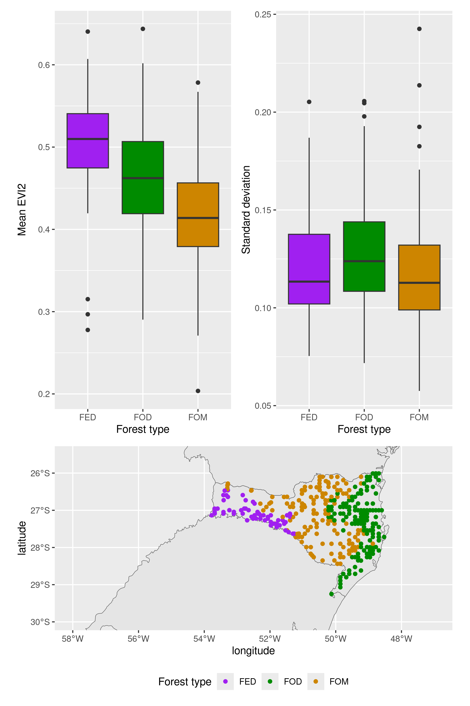
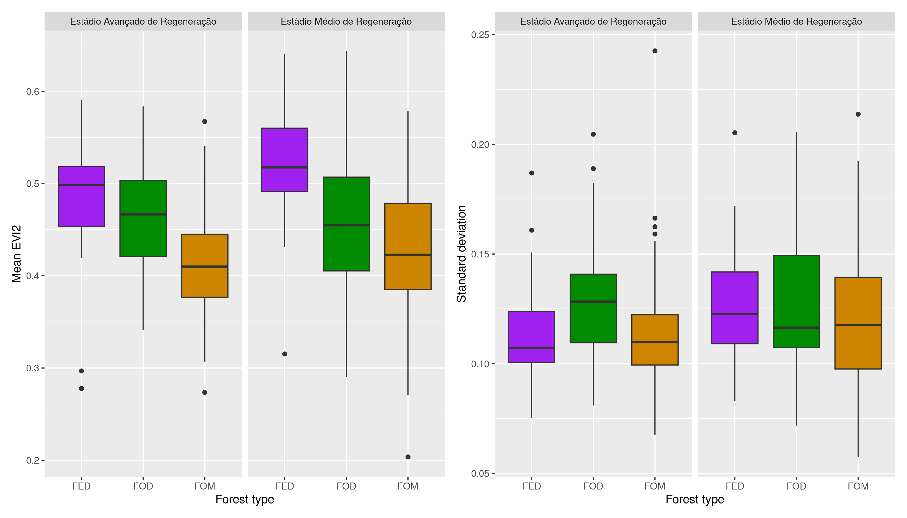
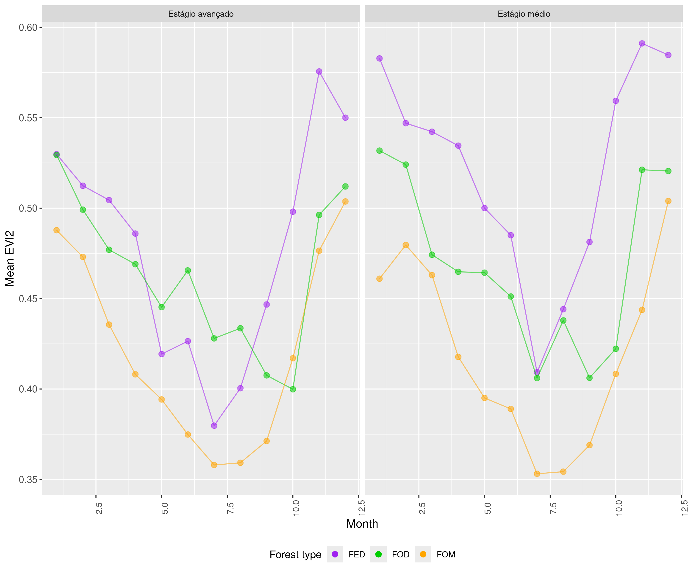
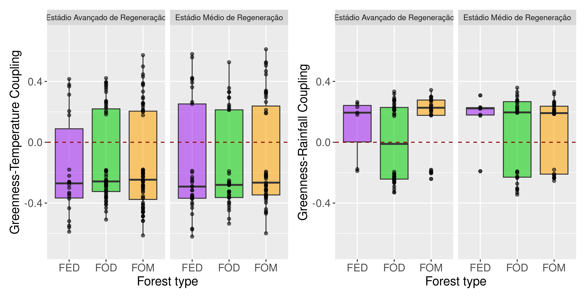
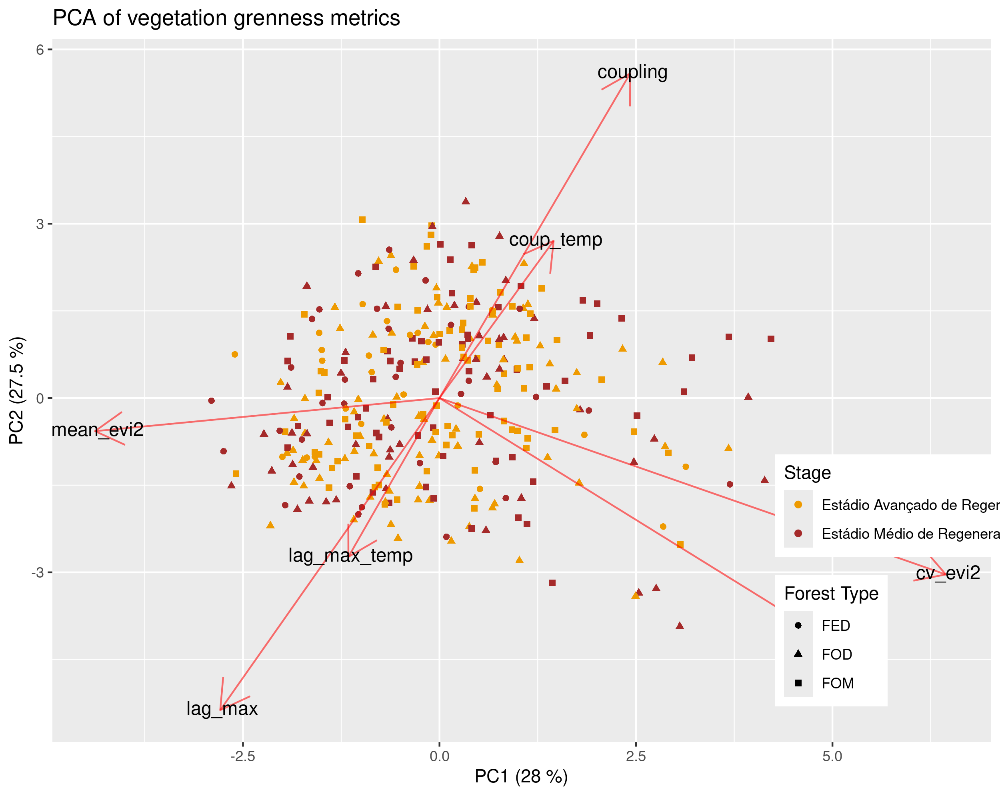
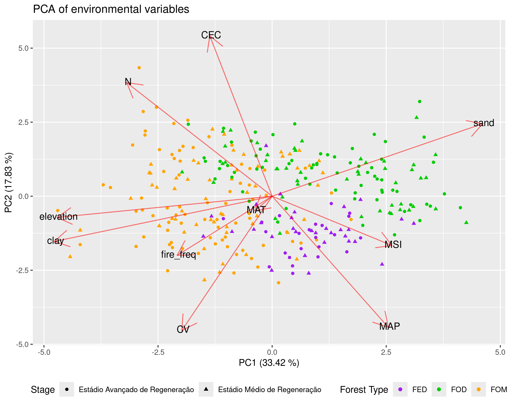
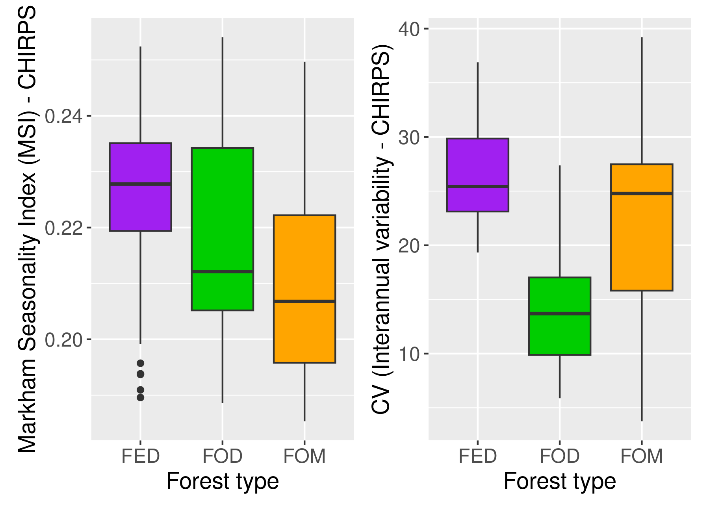

# IFFSC
This repository contains all the data and scripts to explore the greenness response of the vegetation from the Forest Floristic Inventory of Santa Catarina to seasonal variations in rainfall and temperature.

### Script for downloading the EVI2 time series from Sentinel-2: https://code.earthengine.google.com/4055e6187ec02f33845b54a4b032e44c

### Script for downloading the rainfall time series from the CHIRPS dataset: https://code.earthengine.google.com/bd2c602a7c7f3b46b12992351f64fe60

### Script for downloading the temperature time series from ERA 5: <https://code.earthengine.google.com/47f05149a37c665650b4e520edebfff0>
 
<i>Figure 1:<i/> Upper panels show mean and standard deviation in EVI2, respectivelly. The bottom panel shows sample plot distribution in the Santa Catarina state. Colors indicate forest types according to the legend.

 
<i>Figure 2:<i/> Mean and standard deviation in EVI2, respectively, for distinct forest types and forest regeneration stages: advanced stage of regeneration (left) and medium stage of regeneration (right).

   
<i>Figure 3:<i/> Mean monthly annual cycle in EVI2 for distinct forest types in different regeneration stages.

 <i>Figure 4:<i/> Greenness-temperature coupling (left panel) and greenness-rainfall coupling (right panel) for distinct forest types in different regeneration stages.

 
<i>Figure 5:<i/> PCA of EVI2-derived metrics to characterize forest types' and regeneration stages' greenness dynamics.

 
<i>Figure 6:<i/> PCA of environmental variables to characterize forest types' and regeneration stages' regarding its environmental conditions.

   
<i>Figure 7:<i/> Distribution of the Markham seasonality index (MSI) and interannual variability (CV) of rainfall for each forest type.

